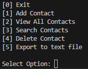
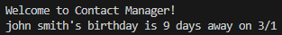
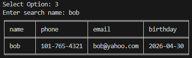
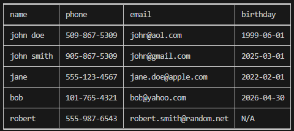

markdown

# Contact Manager

A simple command-line contact book application. Data is stored in a JSON file to save data between sessions. I built this program to strengthen my understanding of file handling, JSON file data storage, program structure, as well as using third party libraries in Python.

## Features
- Add contacts including name, phone, and email.
- View all contacts in a formatted table using the tabulate package.
- Search function. User can search contacts by name using list comprehension.
- Delete contacts. User can select contact from list to delete.
- Automatic save/load functionality. Creates JSON file and or empty global lists if any files are missing or problematic.
- Upcoming birthday detection. Automatically calculates and displays the next contacts birthday.
- Export function. Allows user to export stored contacts to a text file.
- Input validation. Rejects invalid user inputs and provides feedback.

## How to Run
```
bash
git clone https://github.com/andreigurd/contact-manager
cd contact-manager
pip install tabulate
python contact_manager.py
```
**Prerequisites:**
- Python 3.x
- pip packages: `tabulate`.

## 📸 Screenshots





## 🧠 What I Learned
- Exporting to text file was valuable as it provided a cleaner more readable format than CSV for this application.
- How to implement an upcoming date detection feature. The challenge of this was to insure the stored date and date now were both in the same format to allow comparison.
- How to validate input to ensure @ was included for valid email. I would do this differently and include requirement for valid input for the website.
- To create files from VS Code terminal directly.
- How to use .gitignore file to specify what files to ignore and to not put on GitHub.


## 🔮 Future Improvements
- I'd like to add a detect duplicate contact feature. It would be valuable to have feedback if name, number, or email has already been entered.
- I'd like to do convert any applicable parts of the code into functions to reduce redundancy.

## 🤝 Contributing
This is a learning project, but feedback is welcome!


